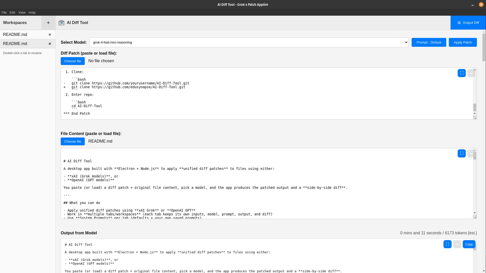
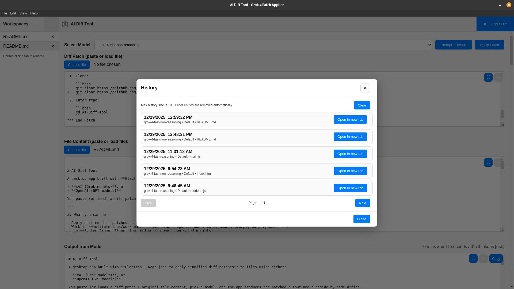
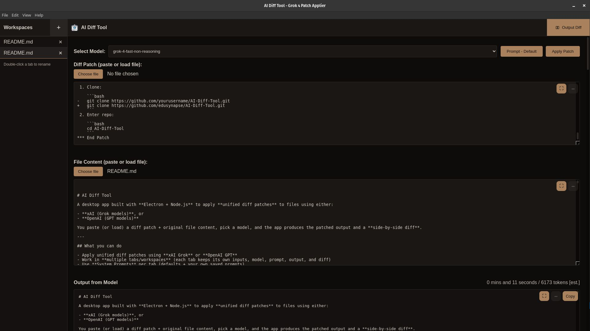

# AI Diff Tool

A desktop app built with **Electron + Node.js** to apply **unified diff patches** to files using either:

- **xAI (Grok models)**, or
- **OpenAI (GPT models)**

You paste (or load) a diff patch + original file content, pick a model, and the app produces the patched output and a **side-by-side diff**.

---

## What you can do

- Apply unified diff patches using **xAI Grok** or **OpenAI GPT**
- Work in **multiple tabs/workspaces** (each tab keeps its own inputs, model, prompt, output, and diff)
- Use **System Prompts** per tab (defaults + your own saved prompts)
- Store both **xAI and OpenAI API keys** locally (encrypted)
- Auto-check for updates on startup (via **GitHub Releases**) and show an update modal when a new version is available
- Toggle **Dark Mode**
- View and reopen past runs in **History** (open any past run in a new tab)
- Switch UI language (with an **EN fallback**)

---

## Download (prebuilt binaries) — recommended

If you just want to run the app without building from source, download a prebuilt binary from the GitHub Releases page:

- https://github.com/edusynapse/AI-Diff-Tool/releases

Steps:

1. Open the Releases page and click the **latest release**.
2. Under **Assets**, download the file for your OS:
   - **Linux:** `.AppImage`
   - **Windows:** portable `.exe`
   - **macOS:** `.zip`
3. Run it:
   - **Linux (AppImage):**
     ```bash
     chmod +x "AI Diff Tool-*.AppImage"
     ./"AI Diff Tool-*.AppImage"
     ```
   - **Windows (portable EXE):** double-click the `.exe`
   - **macOS (zip):** unzip and open the app (you may need to allow it in Privacy/Security)

Notes:

- The app **auto-checks for updates on startup** and will prompt you to download the newer version from GitHub Releases.
- This section is for **end users** (download + run). Source build instructions remain below.

---

## Screenshots

Screenshots live in the repo at:

- `images/screenshot_1.jpg`
- `images/screenshot_2.jpg`
- `images/screenshot_3.jpg`

Default Interface



History View



Dark Mode



---

## Setup (All Platforms)

1. Clone:

   ```bash
   git clone https://github.com/edusynapse/AI-Diff-Tool.git
   ```
2. Enter repo:

   ```bash
   cd AI-Diff-Tool
   ```
3. Install deps:

   ```bash
   npm install
   ```
4. Run in dev:

   ```bash
   npm start
   ```

---

## Quick start (first run)

1. Create or pick a workspace tab (left sidebar).
2. Select a model from the dropdown:
   - `grok-*` models use **xAI**
   - `gpt-*` models use **OpenAI**
3. Paste or load:
   - **Diff Patch** (unified diff)
   - **File Content** (original content)
4. Add your API key (xAI or OpenAI) if needed:
   - If **no keys exist at all**, the app will first ask which provider you want to set up (**xAI** or **OpenAI**).
5. Click **Apply Patch**.
6. Review the output + “Diff with original”, then **Copy** or **Download**.

---

## API keys (xAI + OpenAI) and PIN encryption

This app supports **both** providers. You can store **one xAI key** and **one OpenAI key**.

### How to add/update your xAI API key

- Open: **File → xAI API Key…** (shortcut: **Cmd/Ctrl + K**)
- Paste your xAI key (get it from xAI’s console)
- Set a **6-digit PIN** (only required when creating your first key / when no PIN is set)
- Click **Save**

### How to add/update your OpenAI API key

- Open: **File → OpenAI API Key…** (shortcut: **Cmd/Ctrl + Shift + K**)
- Paste your OpenAI key (`sk-...`)
- If your PIN is already set in this session, you won’t be asked again
- Click **Save**

### How provider selection works

- When you pick a **Grok** model (`grok-*`), the app uses your **xAI key**
- When you pick a **GPT** model (`gpt-*`), the app uses your **OpenAI key**
- If the required provider key is missing (or locked), the app will prompt you

### What the PIN does (and does NOT do)

- Your API keys are stored **encrypted locally** using your **6-digit PIN**
- The **PIN is not stored** on disk
- You “unlock” your saved keys **once per app session** (so you don’t have to keep re-entering it)
- You can change your PIN via **File → PIN Change…** (re-encrypts your saved keys locally)

> If you forget your PIN, you won’t be able to decrypt your previously saved keys.
> You can use **File → Clean and Reset…** to wipe local app data and set up keys again.

---

## Tabs / Workspaces

Tabs live in the **left sidebar** and behave like independent workspaces.

Each tab keeps its own:

- Selected model
- System prompt selection
- Diff patch text
- File content text
- Output
- Diff view
- Expand/minimize state of the text areas

### Tab actions

- **New tab:** click **+** (or **Cmd/Ctrl + T**)
- **Rename:** double-click a tab
- **Close:** click the **×** on the tab (or **Cmd/Ctrl + W**) — a confirmation dialog appears
- **Switch tabs:** **Cmd/Ctrl + Tab** (next) / **Cmd/Ctrl + Shift + Tab** (previous)

---

## Menu items (what they do)

### File

- **xAI API Key…** (**Cmd/Ctrl + K**)  
  Add/update your xAI key (encrypted with your PIN).
- **OpenAI API Key…** (**Cmd/Ctrl + Shift + K**)  
  Add/update your OpenAI key (encrypted with your PIN).
- **PIN Change…**  
  Change your 6-digit PIN and re-encrypt saved keys locally.
- **Clean and Reset…**  
  Wipes local app data (keys, history, prompts, tabs, settings, language selection).
- **Quit / Close**  
  Standard platform behavior (Quit on Windows/Linux, Close on macOS).

### Edit

- Standard editing commands (Undo/Redo/Cut/Copy/Paste/Select All)
- **System Prompt…** (**Cmd/Ctrl + Shift + P**)  
  Manage saved prompts and apply one to the current tab.

### View

- **History…** (**Cmd/Ctrl + H**)  
  Browse past runs and reopen any item in a new tab.
- **Language…**  
  Pick UI language (EN fallback). UI updates immediately (older builds may reload).
- **Dark Mode** (**Cmd/Ctrl + D**)  
  Toggle dark theme.
- **Previous Change** (**F7**) / **Next Change** (**F8**)  
  Jump between diff changes.
- Standard Electron view items (Reload, DevTools, Zoom, Fullscreen)

### Help

- **Usage** (**F1**)  
  Opens the in-app usage guide.
- **About…**  
  App info + GitHub link + donation section (if configured).

---

## Language support (i18n)

- Change language from **View → Language…**
- The app uses **EN** as the fallback language
- Language packs live here:
  - Dev: `build/languages/*.json`
  - Packaged app: copied into the app’s resources folder as `languages/*.json`

### Adding a new language

1. Copy `build/languages/EN.json` to a new file, e.g. `build/languages/FR.json`
2. Translate values (keep keys the same)
3. Restart the app (or reopen the language modal) and select the new language

---

## History feature

History keeps a local record of your past patch runs so you can return to them later.

- Open: **View → History…**
- Each entry includes metadata like timestamp, model, prompt name, and input file name
- Click **Open in new tab** to restore that run into a new workspace tab
- **Clear** removes all history (cannot be undone)

Notes:

- History is stored **locally** (in the app’s local storage) and compressed to save space
- History contains your inputs/outputs for those runs (diff text, file content, model output)

---

## Building the App

This project uses **electron-builder** and outputs artifacts into `dist/`.

* **Linux:** AppImage (portable)
* **Windows:** Portable `.exe` (single file)
* **macOS:** Zip (x64 + arm64)

> If you are building Windows from Linux, you must use **Docker** (recommended) or install Wine/Mono locally.
> Building macOS artifacts generally requires macOS (Apple tooling), but this repo includes the mac target config for when you build on mac.

---

# Build Instructions — Linux

## A) Build Linux AppImage (native on Linux)

```bash
npm ci
npx electron-builder --linux appimage
```

Output:

* `dist/AI Diff Tool-1.0.1.AppImage`

### Run the AppImage

```bash
chmod +x "dist/AI Diff Tool-1.0.1.AppImage"
./"dist/AI Diff Tool-1.0.1.AppImage"
```

### Optional: Desktop launcher (AppImage)

Create: `~/.local/share/applications/ai-diff-tool.desktop`

```ini
[Desktop Entry]
Name=AI Diff Tool
Exec=/absolute/path/to/dist/AI Diff Tool-1.0.1.AppImage
Icon=/absolute/path/to/icon.png
Type=Application
Categories=Utility;
Terminal=false
```

Then:

```bash
chmod +x ~/.local/share/applications/ai-diff-tool.desktop
```

---

## B) Build Windows portable EXE from Linux (Docker required)

### 1) Install Docker

Install Docker for your distro (Docker Engine is enough; Docker Desktop is optional).

### 2) Prepare host cache dirs (speed-up)

These folders are on your **host machine**, not inside the app folder:

```bash
mkdir -p ~/.cache/electron ~/.cache/electron-builder
```

### 3) Run the Windows build using the builder image (Wine)

Use either the long command or the npm script.

**Long command (your current working command):**

```bash
docker run --rm -t \
  -v "$PWD":/project -w /project \
  -v "$HOME/.cache/electron":/root/.cache/electron \
  -v "$HOME/.cache/electron-builder":/root/.cache/electron-builder \
  electronuserland/builder:wine \
  bash -lc "npm ci && npx electron-builder --win portable --x64"
```

**Or use the script:**

```bash
npm run dist:win:docker
```

Output:

* `dist/AI Diff Tool 1.0.1.exe` (portable single EXE)

---

# Build Instructions — Windows

## A) Build Windows portable EXE (native on Windows)

### 1) Prereqs

* Node.js (LTS recommended)
* Git (optional but useful)

### 2) Install & build

From repo root:

```powershell
npm ci
npx electron-builder --win portable --x64
```

Output:

* `dist\AI Diff Tool 1.0.1.exe`

> Note: On Windows, builds can trigger Defender/SmartScreen warnings for unsigned executables. That’s expected unless you code-sign.

---

## Notes / Tips

* **Icons**

  * Windows icon must be a real `.ico` (multi-size) at: `build/icons/icon.ico`
  * macOS icon should be `.icns` at: `build/icons/icon.icns`
* **Settings persistence**

  * API keys (encrypted), prompts, history, and preferences persist via Electron’s local storage / user profile storage.
* **File support**

  * Works for any text-based files (JS, HTML, etc.). Large inputs show warnings.
* **Last updated**

  * Dec 29, 2025.